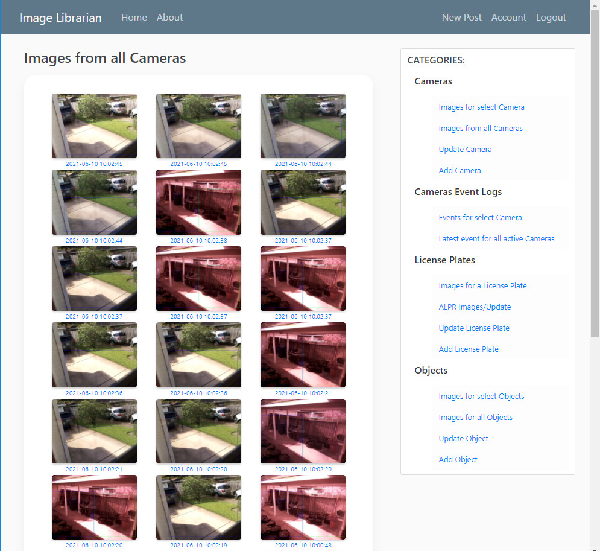
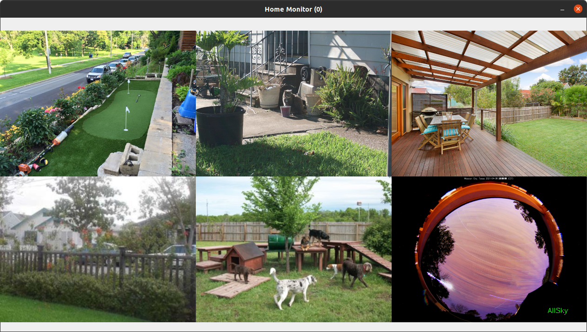
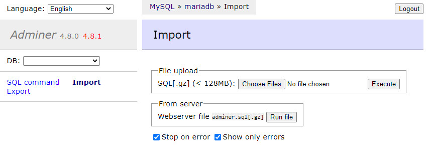
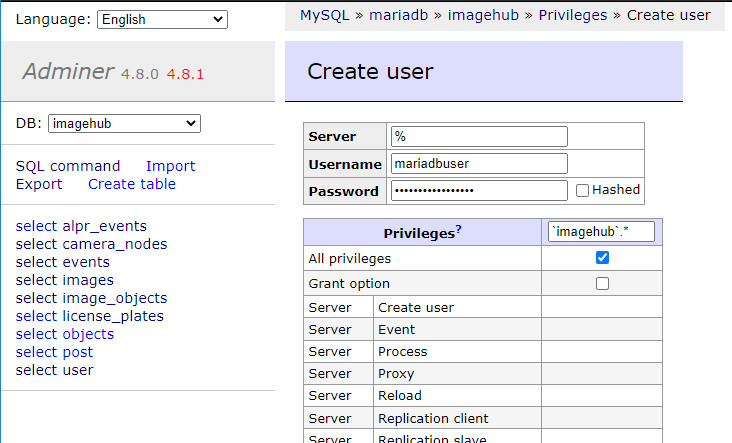
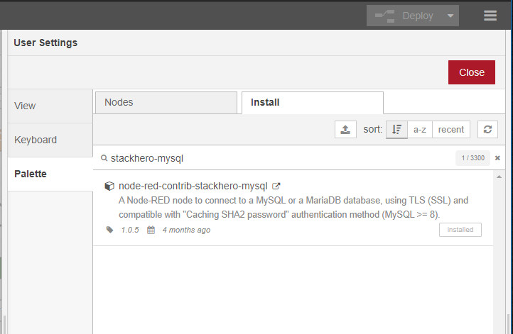
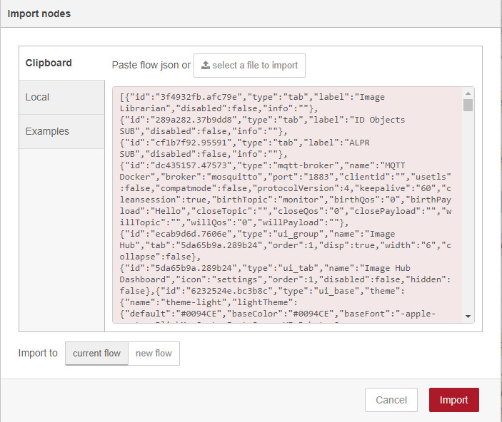
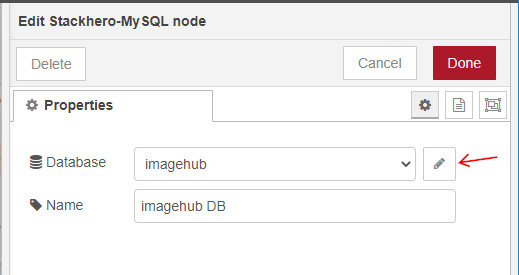
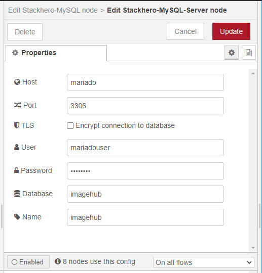
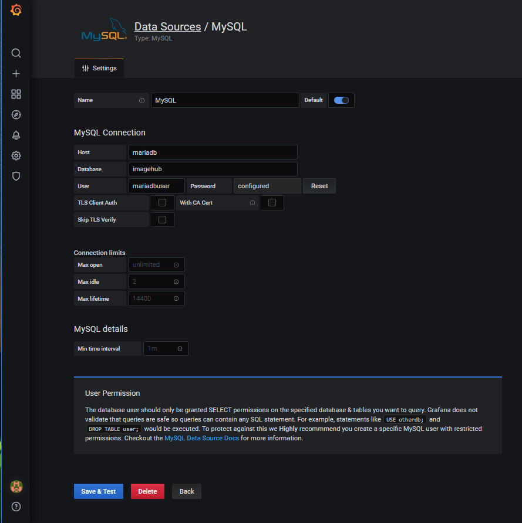
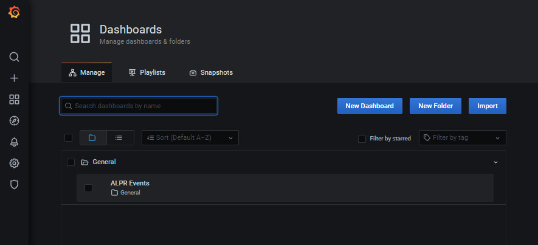

================================================================================================
imagehub-librarian: An Application for Receiving, Saving and Managing Images from Raspberry Pi's
================================================================================================

Introduction
============

The **imagehub-librarian** is a Docker based application using
Node-Red, MQTT, MariaDB and OpenCV containers along with the `imagehub <https://github.com/jeffbass/imagehub>`_
package from Jeff Bass to receive, save and manage images received
from Raspberry Pi's (RPi's). Containers of Grafana and
Flask are integrated into this application to monitor statistics, and
manage the hardware and images.

Here are a couple of images of the **imagehub-librarian** dashboards for viewing and managing the cameras and images
captured by **imagehub**:

Additionally, this application is capable of detecting the objects of captured images.  If a 'car' is detected, this
application is capable of performing Automatic License Plate Recognition (ALPR) on the captured image.  All of the
object dection and ALPR data is stored in a relational database, and can be monitored in Grafana and the Flask
sections of **imagehub-librarian**.

.. contents::

Overview
========

Jeff Bass's **imagehub** application is the backbone of this application.  It is the "receive and store" part of a
distributed computer vision pipeline that is run on multiple computers. Multiple Raspberry Pi (and other) computers
run **imagenode** to capture images, detect motion, light, temperature values, etc. **Imagenode** then sends event
messages and selected images to **imagehub**, which files the events and images for later analysis.  Typically,
**imagehub** can manage up to 8 to 12 sending computers.

By design, **imagehub** is a very simple program. It does 2 things:

1. It receives images and stores them.
2. It receives event messages and logs them.

It does this from multiple sources simultaneously. The sources are typically a bunch of Raspberry Pi computers with
PiCameras and temperature sensors. Keeping **imagehub** simple allows it to be fast enough to reliably store data from
multiple sources. Analysis of images and responses to queries are handled by other programs. See `Using imagenode in
distributed computer vision projects <https://github.com/jeffbass/imagenode/blob/master/docs/imagenode-uses.rst>`_
for a more detailed explanation of the overall project design.

The **imagehub-librarian** provides a means of viewing and monitoring the log files and images saved
by **imagehub**.  Plus, it adds a means of object detection and ALPR for selected cameras.

imagehub-librarian Features
===========================

- Records the images and sensor events saved by **imagehub** in a database.
- Inspects the images for objects and records the results.
- Triggered events based on detected objects. For example, if a 'car' or 'truck' is detected, the image might be analyzed for a License Plate via ALPR.

Dependencies and Installation
=============================

**imagehub-librarian** has been tested with:

- ubuntu 20.04 LTS running on a BMAX Mini PC with Intel Celeron J4125, 8GB DDR4 and 500GB NVMe Internal SSD
- `imagehub <https://github.com/jeffbass/imagehub>`_ Version 0.2.0 - 2021-01-17
- `IOTstack <https://github.com/SensorsIot/IOTstack>`_ - on 2021-06-04

The **IOTstack** package provides the docker framework for the **imagehub-librarian**.  The librarian
builds two additional docker images, and provides the configuration files and instructions for
the **IOTstack** installed docker images.  To install **IOTstack**::

    sudo apt install -y curl git net-tools openssh-server htop apt-utils
    curl -fsSL https://raw.githubusercontent.com/SensorsIot/IOTstack/master/install.sh | bash

After executing the above lines. Change directory to IOTstack and execute the menu.sh shell file::

    cd ~/IOTstack
    ./menu.sh

This will install PIP and docker, and require a reboot.  Log in again and change directory to IOTstack
and execute the menu.sh again and select "Build Stack"::

    cd ~/IOTstack
    ./menu.sh
    Select "Build Stack"

Select the following images to build the stack::

    adminer
    mariadb
    mosquitto
    nodered
    portainer-ce

After the stack has been built, and the menu has been exited DO NOT START Docker.  There are a few task
to complete before Docker is started.  To insure your Docker has not started::

    cd ~/IOTstack
    docker-compose down

Install **imagehub** in the IOTstack folder. Note: Do not follow the **imagehub** installation instructions.  Imagehub will run from
a docker container. Therefore, the imagehub.service doesn't need to be configured and installed to run::

    cd ~/IOTstack
    git clone https://github.com/jeffbass/imagehub.git

Change the **imagehub** data_directory in the imagehub.yaml file to your Docker data location::

    nano imagehub/imagehub.yaml

Edit the data_directory field to match your installation. Change 'YOUR_HOME_DIRECTORY' to your username or folder name::

    data_directory: /home/YOUR_HOME_DIRECTORY/IOTstack/volumes/nodered/data/imagehub_data

At the time of this installation, Node-Red didn't allow for volumes outside of nodered/data path.  Hence,
the unusual imagehub_data location seen above.

Install the **imagehub-librarian** package.  The following will install these files into the IOTstack folder::

    cd ~
    git clone https://github.com/sbkirby/imagehub-librarian.git ~/IOTstack
    cd ~/IOTstack

Several task are required prior to starting Docker.  Edit the openalpr_script.sh and change
'YOUR_HOME_DIRECTORY' to the appropriate folder name::

    nano openalpr_script.sh

Make openalpr_script.sh executable::

    chmod +x openalpr_script.sh

Edit the 'config.json' file, and replace 'YOUR_HOME_DIRECTORY' to the appropriate folder name.  Configure
the email entries to match your email information ('MAIL_SERVER', 'MAIL_PORT', 'MAIL_USE_TLS', 'MAIL_USERNAME', 'MAIL_PASSWORD').
If a 'ALPR_API_TOKEN' is available from `Plate Recognizer <https://www.platerecognizer.com/>`_, enter it in the field::

    nano config.json

Build the OpenCV and Flask images::

    cd ~/IOTstack/docker
    docker build -f flask_Dockerfile -t flask:latest .
    docker build -f opencv_Dockerfile -t opencv:latest .

Rename the 'docker-compose.yml' file built by **IOTstack** and replace it with the file furnished by
**imagehub-librarian**::

    cd ~/IOTstack
    mv docker-compose.yml docker-compose_original.yml
    mv docker-compose_imagehub.yml docker-compose.yml

Edit the 'YOUR_HOME_DIRECTORY' folder locations for Flask and opencv in the NEW 'docker-compose.yml' file::

    nano docker-compose.yml

Tip: Pressing 'Ctrl + \\' in nano will allow for multiple finds and replaces.

Docker can be started::

    cd ~/IOTstack
    docker-compose up -d

All of the containers currently running can be seen via::

    docker ps -a

Configure Docker Images
-----------------------
Next, configure each of the docker containers with files furnished by **imagehub-librarian**.

MariaDB
^^^^^^^
Log into MariaDB via Adminer. Connect to `http://localhost:9080 <http://localhost:9080>`_ ::

    server: mariadb
    user: root
    password: IOtSt4ckToorMariaDb

Import database located in the 'misc' folder:
Import » "Choose Files" imagehub_mariadb_database.sql and "Execute"

Setup privileges for user 'mariadbuser'
MySQL » mariadb » imagehub » Privileges » Create user::

	User: mariadbuser
	Password: IOtSt4ckmariaDbPw
	check 'All privileges'  `imagehub`.*

Node-Red
^^^^^^^^
Log into Node-Red `http://localhost:1880 <http://localhost:1880>`_.  Go to the Menu->Manage palette->Install Tab->search modules, and install
modules 'node-red-contrib-stackhero-mysql' and 'node-red-node-email'.

Go to the Menu->Import->'select a file' to import the **imagehub-librarian** flow.
select file: ~/IOTstack/node-red/Image_Hub_Dashboard_flows.json

Connect the data modules 'imagehub DB' nodes to MariaDB 'imagehub' Database::

    Host: mariadb
    Port: 3306
    User: mariadbuser
    Password: IOtSt4ckmariaDbPw
    Database: imagehub
    Name: imagehub

Grafana
^^^^^^^
Log into Grafana `http://localhost:3000 <http://localhost:3000>`_ ::

    username: admin
    password: admin
    change password if you wish or Skip

First, configure the database used by Grafana by going to menu Configuration -> Data Source::

    Data Service MySQL
    name: MySQL
    Host: mariadb
    Database: imagehub
    User: mariadbuser	Password: IOtSt4ckmariaDbPw
    save & test

Next, install a JSON configuration file, ALPR_Events-grafana.json located in the 'misc' folder, with charts and tables for the 'imagehub' database.
Go to menu Dashboards -> Manage::

    Import -> ALPR_Events-grafana.json
    Name: ALPR Events
    Folder: General
    MySQL: MySQL

Flask
^^^^^
Before images are accessible from Flask, a link to the image folder must be created.  Change 'YOUR_HOME_DIRECTORY' to the
appropriate folder name::

    cd /home/YOUR_HOME_DIRECTORY/IOTstack/flaskblog/static
    ln -s /home/YOUR_HOME_DIRECTORY/IOTstack/volumes/nodered/data/imagehub_data imagehub_data

Log into Flask and create a user for yourself at `http://localhost:5000 <http://localhost:5000>`_.

Running the Tests
=================

**imagehub-librarian** should be tested after you have tested **imagenode**, because you
will be using **imagenode** to send test images and event messages to
**imagehub-librarian**.

Both **imagehub-librarian** and **imagenode** use **imageZMQ** for sending and receiving
images and event messages. The **imageZMQ** package is pip installable. It is
likely that you already have it installed from your tests of **imagenode**. If
not, it should be pip installed in a virtual environment. For example,
my virtual environment is named **py3cv3**.

To install **imageZMQ** using pip:

.. code-block:: bash

    workon py3cv3  # use your own virtual environment name
    pip install imagezmq

Test **imagehub-librarian** in the same virtualenv that you installed **imagenZMQ** in.
For **imageZMQ** and **imagenode** testing, my virtualenv is called ``py3cv3``.

To test **imagehub-librarian**, you will use the same setup as Test 2 for **imagenode**.
You will run **imagenode** on a Raspberry Pi with a PiCamera, just as you did for
**imagenode** Test 2. You will run **imagehub-librarian** on the same Mac (or other display
computer) that you used to display the **imagenode** test images.

Directory Structure for running the imagehub tests
--------------------------------------------------
Neither **imagehub-librarian** or **imagenode** are far enough along in their development
to be pip installable. So they should both be git-cloned to the computers that
they will each be running on. I recommend doing all testing in the user home
directory. Here is a simplified directory layout for the computer that will be
running **imagehub-librarian**::

  ~ # user home directory of the computer running imagehub
  +--- imagehub.yaml  # copied from imagenode/imagenode.yaml in this repository
  |
  +--- imagehub    # the git-cloned directory for imagehub
  |    +--- sub directories include docs, imagehub, tests
  |
  +--- imagehub_data   # this directory will be created by imagehub
       +--- images      # images will be saved here
       +--- logs        # logs containing event messages will be saved here

The **imagehub-librarian** directory arrangement, including docs, **imagehub-librarian** code,
tests, etc. is a common software development directory arrangement on GitHub.
Using ``git clone`` from your user home directory on your **imagehub-librarian** computer
(either on a Mac, a RPi or other Linux computer) will put the **imagehub-librarian**
directories in the right place for testing. When the **imagehub-librarian** program runs,
it creates a directory (``imagehub_data``) with 2 subdirectories (``images`` and
``logs``) to store the images and event messages it receives from **imagenode**
running on one or more RPi's or other computers. Running **imagenode** requires
a settings file named ``imagehub.yaml``. To run the tests, copy the example
``imagehub.yaml`` file from the ``imagehub`` directory to your home directory.
The ``imagehub.yaml`` settings file is expected to be in your home directory,
but you can specify another directory path using the --path optional argument.
I recommend putting the ``imagehub.yaml`` file in your home directory for
testing. You can move the ``imagehub.yaml`` file to a different directory after
you have completed the tests.

Test 1: Running **imagehub-librarian** with a single **imagenode** sender
---------------------------------------------------------------
**The first test** uses a single Raspberry Pi computer running **imagenode**
with **imagehub-librarian** running on Mac or other display computer.
It tests that the **imagehub-librarian** software is installed correctly and that the
``imagehub.yaml`` file has been copied and edited in a way that works.

Test 2: Running **imagehub-librarian** with 2 **imagenode** senders simultaneously
------------------------------------------------------------------------
**The second test** runs **imagenode** on 2 Raspberry Pi computers,
with **imagehub-librarian** receiving images and event messages from both RPi's at
the same time. The event logs and image files will record what is sent
from both RPi's.

Further details of running the tests are `here <docs/testing.rst>`_.

Running **imagehub-librarian** in production
==================================
Running the test programs requires that you leave a terminal window open, which
is helpful for testing, but not for production runs. I use systemctl / systemd
to start **imagehub-librarian** in production. I have provided an example
``imagehub.service`` unit configuration file that shows how I start **imagehub-librarian**
for the production programs observing my small farm. I have found the systemctl
/ systemd system to be best way to start / stop / restart and check status of
**imagehub-librarian** over several years of testing. For those who prefer using a shell
script to start **imagehub-librarian**, I have included an example ``imagehub.sh``. It is
important to run **imagehub-librarian** in the right virtualenv in production, regardless
of your choice of program startup tools.

In production, you would want to set the test options used to print settings
to ``False``; they are only helpful during testing. All errors and **imagenode**
event messages are saved in the file ``imagehub.log`` which is located in the
directory you specify in the ``imagenode.yaml`` setting ``data_directory``:

.. code-block:: yaml

    data_directory: imagehub_data

The ``imagehub.yaml`` settings file is expected to be in the users home
directory by default. You can specify the path to a different directory
containing ``imagehub.yaml`` by using the optional argument ``--path``:

.. code-block:: bash

    workon py3cv3  # use your own virtual environment name
    python3 imagenode.py --path directory_name  # directory holding imagehub.yaml

Additional Documentation
========================
- `How imagehub works <docs/imagehub-details.rst>`_.
- `The imagehub Settings and the imagehub.yaml file <docs/settings-yaml.rst>`_.
- `Version History and Changelog <HISTORY.md>`_.
- `Research and Development Roadmap <docs/research-roadmap.rst>`_.
- `The imageZMQ classes that allow transfer of images <https://github.com/jeffbass/imagezmq>`_.
- `The imagenode program that captures and sends images <https://github.com/jeffbass/imagenode>`_.
- `The larger farm automation / computer vision project <https://github.com/jeffbass/yin-yang-ranch>`_.
  This project shows the overall system architecture. It also contains
  links to my **PyCon 2020** talk video and slides explaining the project.

Contributing
============
**imagehub-librarian** is in early development and testing. I welcome open issues and
pull requests, but because the code is still rapidly evolving, it is best
to open an issue with some discussion before submitting any pull requests or
code changes.  We can exchange ideas about your potential pull request and how
to best incorporate and test your code.

Acknowledgments
===============
- **ZeroMQ** is a great messaging library with great documentation
  at `ZeroMQ.org <http://zeromq.org/>`_.
- **PyZMQ** serialization examples provided a starting point for **imageZMQ**.
  See the
  `PyZMQ documentation <https://pyzmq.readthedocs.io/en/latest/index.html>`_.
