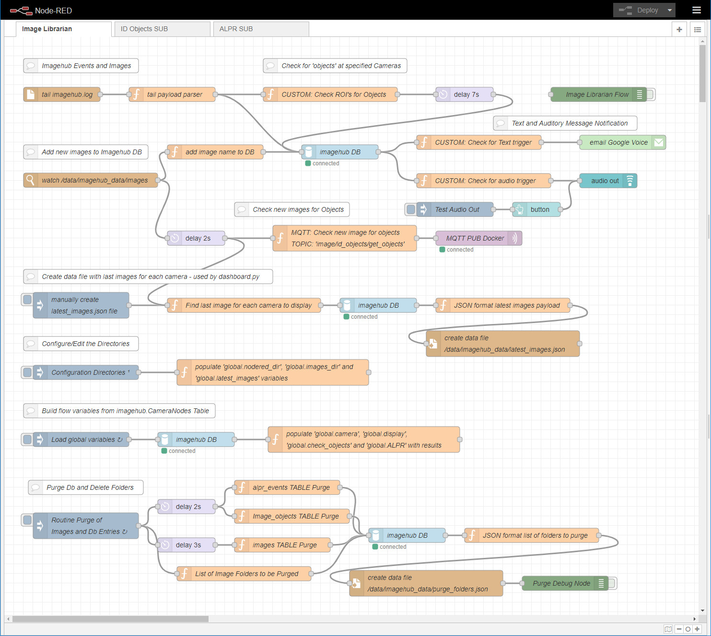
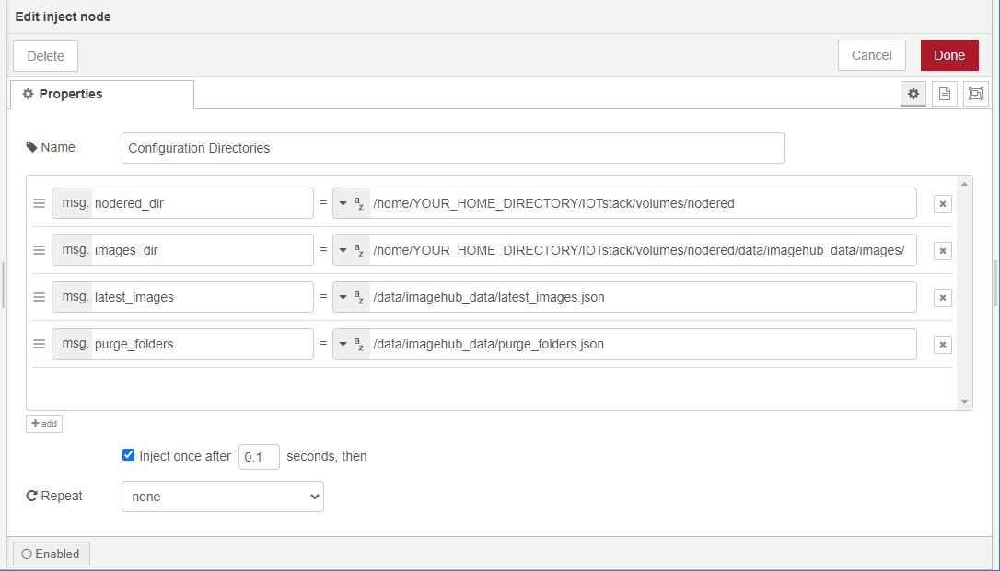
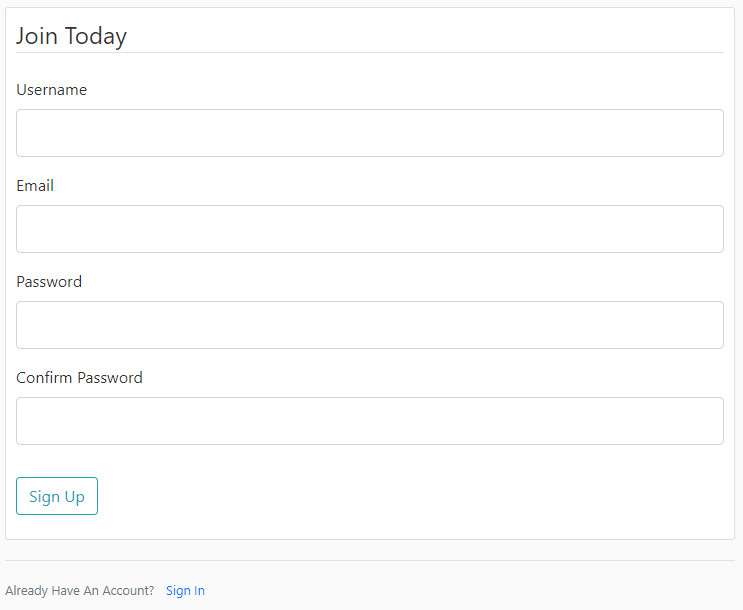

================================================================================================
imagehub-librarian: An Application for Receiving, Saving and Managing Images from Raspberry Pi's
================================================================================================

Introduction
============

The **imagehub-librarian** is a Docker based application using
Node-Red, MQTT, MariaDB and OpenCV containers along with the `imagehub <https://github.com/jeffbass/imagehub>`_
package from Jeff Bass to receive, save and manage images received
from Raspberry Pi's (RPi's). Containers of Grafana and
Flask are integrated into this application to monitor statistics, and
manage the hardware and images.

Here are a couple of images of the **imagehub-librarian** dashboards for viewing and managing the cameras and images
captured by **imagehub**:

.. image:: librarian-docs/images/Flask_View.jpg
    :width: 600px
    :height: 452px
    :align: center
    :alt: Example of Flask webpage

Additionally, this application is capable of detecting the objects of captured images.  If a 'car' is detected, this
application is capable of performing Automatic License Plate Recognition (ALPR) on the captured image.  All of the
object detection and ALPR data is stored in a relational database, and can be monitored in Grafana and the Flask
sections of **imagehub-librarian**.

.. contents::

Overview
========

The **imagehub** application is the backbone of this application.  It is the "receive and store" part of a
distributed computer vision pipeline that is run on multiple computers. Multiple Raspberry Pi (and other) computers
run **imagenode** to capture images, detect motion, light, temperature values, etc. **Imagenode** then sends event
messages and selected images to **imagehub**, which files the events and images for later analysis.  Typically,
**imagehub** can manage up to 8 to 12 sending computers.

By design, **imagehub** is a very simple program. It does 2 things:

1. It receives images and sensor events (e.g. temperature, humidity, light) and stores them.
2. It receives **imagenode** status messages and logs them.

It does this from multiple sources simultaneously. The sources are typically a bunch of Raspberry Pi computers with
PiCameras and temperature sensors. Keeping **imagehub** simple allows it to be fast enough to reliably store data from
multiple sources. Analysis of images and responses to queries are handled by other programs. See `Using imagenode in
distributed computer vision projects <https://github.com/jeffbass/imagenode/blob/master/docs/imagenode-uses.rst>`_
for a more detailed explanation of the overall project design.

The **imagehub-librarian** provides a means of viewing and monitoring the log files and images saved
by **imagehub**.  Plus, it adds a means of object detection and ALPR for selected cameras.

imagehub-librarian Features
===========================

- Records the images and sensor events saved by **imagehub** in a database.
- Inspects the images for objects and records the results.
- Triggered events based on detected objects. For example, if a 'car' or 'truck' is detected, the image might be analyzed for a License Plate via ALPR.

Dependencies and Installation
=============================

**imagehub-librarian** has been tested with:

- ubuntu 20.04 LTS running on a BMAX Mini PC with Intel Celeron J4125, 8GB DDR4 and 500GB NVMe Internal SSD
- `imagehub <https://github.com/jeffbass/imagehub>`_ Version 0.2.0 - 2021-01-17
- `IOTstack <https://github.com/SensorsIot/IOTstack>`_ - 2021-06-04

The **IOTstack** package provides the docker framework for the **imagehub-librarian**.  The librarian
builds two additional docker images, and provides the configuration files and instructions for
the **IOTstack** installed docker images.  To install **IOTstack**::

    sudo apt install -y curl git net-tools openssh-server htop apt-utils
    curl -fsSL https://raw.githubusercontent.com/SensorsIot/IOTstack/master/install.sh | bash

This will check the system enviroment and install the necessary tools to complete the install...it may require a reboot.
Log in again and change directory to IOTstack and execute the ``menu.sh`` again and select "Build Stack"::

    cd ~/IOTstack
    ./menu.sh
    Select "Build Stack"

Select the following images to build the stack::

    adminer
    mariadb
    mosquitto
    nodered
    portainer-ce

After the stack has been built, and the menu has been exited **DO NOT START** Docker.  There are a few task
to complete before Docker is started.  To insure your Docker has not started::

    cd ~/IOTstack
    docker-compose down

Install imagehub
----------------
Install **imagehub** in the IOTstack folder. Note: Do not follow the **imagehub** installation instructions.  Imagehub will run from
a docker container. Therefore, the imagehub.service doesn't need to be configured and installed to run::

    cd ~/IOTstack
    git clone https://github.com/jeffbass/imagehub.git

Change the **imagehub** data_directory in the ``imagehub.yaml`` file to your Docker data location::

    nano imagehub/imagehub.yaml

Edit the ``data_directory`` field of ``imagehub.yaml`` to match your installation as seen below. Change ``YOUR_HOME_DIRECTORY`` to your username or folder name::

    data_directory: /home/YOUR_HOME_DIRECTORY/IOTstack/volumes/nodered/data/imagehub_data

At the time of this installation, Node-Red didn't allow for volumes outside of ``/home/YOUR_HOME_DIRECTORY/IOTstack/volumes/nodered/data`` path.  Hence,
the unusual ``imagehub_data`` location seen above.

Install imagehub-librarian
--------------------------
Install the **imagehub-librarian** package.  The following will install the package and move these files into the IOTstack folder::

    cd ~
    git clone https://github.com/sbkirby/imagehub-librarian.git
    cd imagehub-librarian
    chmod +x copy_all.sh
    ./copy_all.sh
    cd ~/IOTstack

Several task are required prior to starting Docker.  Edit the openalpr_script.sh and change
``YOUR_HOME_DIRECTORY`` to the appropriate folder name::

    cd ~/IOTstack
    nano openalpr_script.sh

Make ``openalpr_script.sh`` executable::

    chmod +x openalpr_script.sh

Edit config.json
----------------
Edit the ``config.json`` file, and replace ``YOUR_HOME_DIRECTORY`` to the appropriate folder name.  Configure
the email entries to match your email information ('MAIL_SERVER', 'MAIL_PORT', 'MAIL_USE_TLS', 'MAIL_USERNAME', 'MAIL_PASSWORD').
If a ``ALPR_API_TOKEN`` is available from `Plate Recognizer <https://www.platerecognizer.com/>`_, enter it in the field.
The ``ALPR_regions`` should set to your areas Region Code.  Refer to these codes in the `Countries - ALPR API Documentation <https://docs.platerecognizer.com/#countries>`_.
Refer to `ALPR Operations <librarian-docs/ALPR_operations.rst>`_ for additional information::

    cd ~/IOTstack
    nano config.json

Build OpenCV and Flask Docker Images
------------------------------------
Build the OpenCV and Flask images for Docker.  Be sure to include the 'period' in the following commands. This will
take a while to build these images::

    cd ~/IOTstack/docker
    docker build -f flask_Dockerfile -t flask:latest .
    docker build -f opencv_Dockerfile -t opencv:latest .

Configure docker-compose.yml file
---------------------------------
Rename the ``docker-compose.yml`` file built by **IOTstack** and replace it with the file furnished by
**imagehub-librarian**::

    cd ~/IOTstack
    mv docker-compose.yml docker-compose_original.yml
    mv docker-compose_imagehub.yml docker-compose.yml

Edit the ``YOUR_HOME_DIRECTORY`` folder locations for Flask and opencv in the NEW ``docker-compose.yml`` file::

    nano docker-compose.yml

Tip: Pressing ``Ctrl + \`` in nano will allow for multiple finds and replaces.

Create link to imagehub Images for Flask access
-----------------------------------------------
Before Docker is started, a link to the image folder must be created for Flask.  Change ``YOUR_HOME_DIRECTORY`` to the
appropriate folder name::

    cd /home/YOUR_HOME_DIRECTORY/IOTstack/flaskblog/static
    ln -s /home/YOUR_HOME_DIRECTORY/IOTstack/volumes/nodered/data/imagehub_data imagehub_data

Start Docker
------------
Docker can be started from the ``IOTstack`` folder::

    cd ~/IOTstack
    docker-compose up -d

All of the containers currently running can be seen via::

    docker ps -a

Configure Docker Images
=======================
Next, configure each of the docker containers with files furnished by **imagehub-librarian**.

MariaDB
-------
Login
^^^^^
Log into MariaDB via **Adminer**. Connect to Adminer `http://localhost:9080 <http://localhost:9080>`_ ::

    server: mariadb
    user: root
    password: IOtSt4ckToorMariaDb

Import imagehub database
^^^^^^^^^^^^^^^^^^^^^^^^
Import the SQL database file ``~/IOTstack/misc/imagehub_mariadb_database.sql``::

   Import » "Choose Files" imagehub_mariadb_database.sql and "Execute"

Setup Privileges for mariadbuser
^^^^^^^^^^^^^^^^^^^^^^^^^^^^^^^^
Privileges for user 'mariadbuser' must be created.  Change to the ``imagehub`` database and set the ``Privileges``
for the user ``mariadbuser``::

	MySQL » mariadb » imagehub » Privileges » Create user
	User: mariadbuser
	Password: IOtSt4ckmariaDbPw
	check 'All privileges'  `imagehub`.*

.. image:: librarian-docs/images/mariadb_privileges_create_user.jpg

Node-Red
--------
Import Modules
^^^^^^^^^^^^^^
Log into Node-Red `http://localhost:1880 <http://localhost:1880>`_.  Go to the ``Menu->Manage palette->Install Tab->search modules``, and install
modules ``node-red-contrib-stackhero-mysql`` and ``node-red-node-email``.

Import Flows
^^^^^^^^^^^^
Go to the ``Menu->Import->'select a file'`` to import the **imagehub-librarian** flow.
select file: ``~/IOTstack/misc/Image_Librarian_Dashboard_flows.json``

.. image:: librarian-docs/images/nodered_import_flow.jpg
    :alt: Import Flow - select JSON file

The ``Image_Librarian_Dashboard_flows.json`` file import the *imagehub-librarian*, *ID Objects SUB* and
*ALPR SUB* flows.  The *imagehub-librarian* flow is the primary flow that triggers events in the *ID Objects SUB* and
*ALPR SUB* via MQTT messages passed between the other flows and the ``MQTT_client.py`` module.

.. image:: librarian-docs/images/nodered_id_objects_sub_flow.jpg
    :alt: ID Objects SUB Flow
.. image:: librarian-docs/images/nodered_alpr_sub_flow.jpg
    :alt: ALPR SUB Flow

Configure Directories
^^^^^^^^^^^^^^^^^^^^^
The **Configuration Directories** node of the **imagehub-librarian** flow requires modification.  Double click the module, and
edit each of the fields containing directories with ``YOUR_HOME_DIRECTORY``.

Configure imagehub DB module
^^^^^^^^^^^^^^^^^^^^^^^^^^^^
Connect the data modules *imagehub DB* nodes to MariaDB *imagehub* Database::

    Host: mariadb
    Port: 3306
    User: mariadbuser
    Password: IOtSt4ckmariaDbPw
    Database: imagehub
    Name: imagehub

.. image:: librarian-docs/images/nodered_imagehub_DB_edit.jpg

Configure email Google Voice
^^^^^^^^^^^^^^^^^^^^^^^^^^^^
If you wish to receive Text messages from Node-Red for specific events, you will need to setup a
`Google Voice <https://support.google.com/voice/answer/115061>`_ account
and then edit the **email Google Voice** node as shown below.  This node could just as easily be
configured to only send emails to a standard email account.  Edit ``email node`` fields to match your email
account.

Grafana
-------
Login
^^^^^
Log into Grafana `http://localhost:3000 <http://localhost:3000>`_ ::

    username: admin
    password: admin
    change password if you wish or Skip

Data Source
^^^^^^^^^^^
First, configure the database used by Grafana by going to menu ``Configuration -> Data Source``::

    Data Service MySQL
    name: MySQL
    Host: mariadb
    Database: imagehub
    User: mariadbuser	Password: IOtSt4ckmariaDbPw
    save & test

Import JSON Configuration
^^^^^^^^^^^^^^^^^^^^^^^^^
Next, install a JSON configuration file, ``Image_Librarian_Events_grafana.json`` located in the ``~/IOTstack/misc`` folder, with charts and tables for the *imagehub* database.
Go to menu ``Dashboards -> Manage``::

    Import -> Image_Librarian_Events_grafana.json
    Name: ALPR Events
    Folder: General
    MySQL: MySQL

.. image:: librarian-docs/images/grafana_import_dashboard.jpg

Flask
-----
``Register`` as a new user in the ``flaskblog`` website `http://localhost:5000 <http://localhost:5000>`_.

Add any existing cameras to the the database.  Refer to `Flask Operations <librarian-docs/flask_operations.rst>`_ for more details.

Running imagehub-librarian
==========================

Docker
------
All ``docker-compose`` commands must be executed within the folder containing the ``docker-compose.yml`` file.
Starting Docker in detached mode::

   cd ~/IOTstack
   docker-compose up -d

Stopping Docker::

   cd ~/IOTstack
   docker-compose down

The Docker containers currently running can be monitored via the following command::

  docker ps -a

The Docker images created by **IOTstack** and **imagehub-librarian** can be seen via::

   docker images

Additional documentation for **Docker** can be found at `Docker Reference documentation <https://docs.docker.com/reference/>`_.

Portainer-ce
^^^^^^^^^^^^
Managing and controlling Docker is easily done with Portainer-ce `http://localhost:9000/ <http://localhost:9000/>`_.
The containers, images and network can conveniently be managed with this application.

Imagehub
--------
The **imagehub** portion should be tested per the instructions at `imagehub - Running the Test <https://github.com/jeffbass/imagehub#running-the-tests>`_.
A typical **imagehub** installation and operation requires building a python enviroment and configuring and running
a service to run the application.  The **opencv** docker image contains the python enviroment, and runs the ``imagehub.py``
and ``mqtt_client.py`` within a container.  These two routines are required to operate **imagehub-librarian** properly.
Monitor the system resources and these routines via ``htop``.

Monitoring the log files generated by **imagehub** will indicate most problems with this application::

    cat /home/YOUR_HOME_DIRECTORY/IOTstack/volumes/nodered/data/imagehub_data/logs/imagehub.log

Flask
-----
Flask is the web interface to the **imagehub-librarian**.  It provides a means of viewing images and monitoring the
sensor events of the network. Refer to `Flask Operations <librarian-docs/flask_operations.rst>`_ for more details.

Running imagehub-librarian in production
========================================
House Keeping
-------------
This application can generate a large number of images that need to be purged on a routine basis.  The system needs
to run a nightly python module ``purge_folders.py`` to remove the folders and images after a specified number of days.
The number of days to keep is set in the ``msg.daystokeep`` value of the ``Routine Purge of Images and Db Entries``
node in the **imagehub-librarian Flow**.

A ``crotab`` entry needs to added to run the ``purge_folders.py`` each evening.  First, create a directory for the
log files::

  cd ~/IOTstack
  mkdir logs

Start the ``crontab`` editor::

  sudo crontab -e

Enter the following after the last line.  Replace ``YOUR_HOME_DIRECTORY`` with the appropriate location::

  0 01 * * * /usr/bin/python3 /home/YOUR_HOME_DIRECTORY/IOTstack/purge_folders.py >/home/YOUR_HOME_DIRECTORY/IOTstack/logs/cronlog 2>&1

Save and Exit the editor.  The above entry will run every morning at 1:00am.

Additional Documentation
========================
- `How ALPR works <librarian-docs/ALPR_operations.rst>`_.
- `The Flask Image Librarian  <librarian-docs/flask_operations.rst>`_.
- `Grafana setup and operations <librarian-docs/grafana_operations.rst>`_.
- `Node-Red setup and operations <librarian-docs/node-red_operations.rst>`_.
- `dashboard.py AND dashboard_jpg.py operations <librarian-docs/dashboard_operations.rst>`_.
- `imagenode installation cheatsheet <librarian-docs/RPi_imagenode_installation_cheatsheet.rst>`_.
- `Version History and Changelog <HISTORY.md>`_.
- `The imagehub receives and stores images and event messages from multiple sources simultaneously <https://github.com/jeffbass/imagehub>`_.
- `The imagenode program that captures and sends images <https://github.com/jeffbass/imagenode>`_.

Acknowledgments
===============
- **IOTstack** is a well maintained package for building a customized Docker IOT installation - `IOTstack <https://sensorsiot.github.io/IOTstack/Getting-Started/>`_.
- **CoreyMSchafer/Flask_Blog** provided the basic structure for the **imagehub-librarian** Flask application - `CoreyMSchafer/code_snippets <https://github.com/CoreyMSchafer/code_snippets/tree/master/Python/Flask_Blog>`_.
- **PyImageSearch** a great resource of code and knowledge for OpenCV - `PyImageSearch <https://www.pyimagesearch.com/>`_.
- **Jeff Bass** the creator of **imagenode**, **imagehub** and **imagezmq** - `Ying Yang Ranch <https://github.com/jeffbass>`_.
