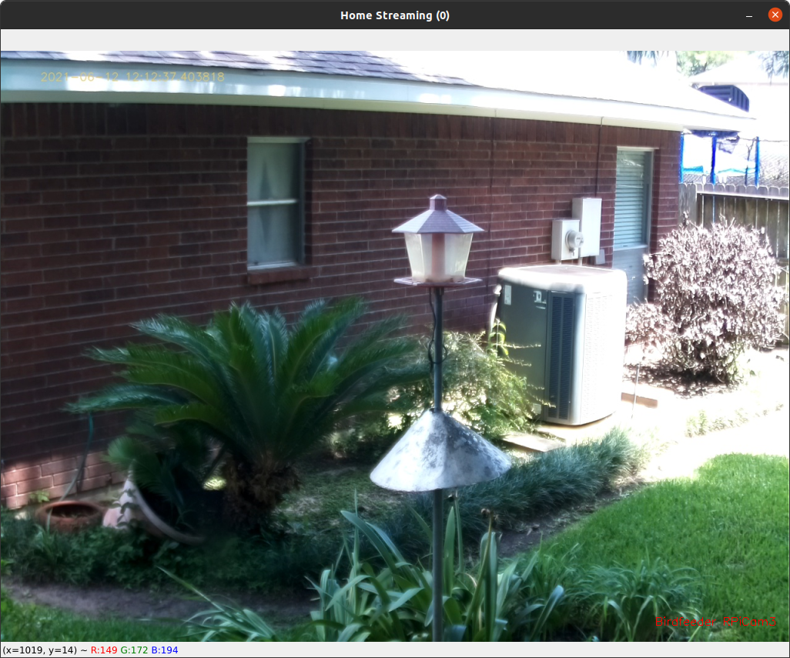

=================================
dashboard.py and dashboard_jpg.py
=================================

.. contents::

Dashboard
=========
The ``dashboard.py`` module is a desktop application to view the latest images from the cameras with the ``Display``
field enabled in the ``camera_nodes`` TABLE.  Each individual image displayed may be clicked to view a larger
version of the thumbnail.  Exiting the ``dashboard.py`` module can be accomplished by typing 'q' when the
window is in focus.

.. image:: images/image_of_dashboard.png
    :alt: Example of Dashboard View

The list of images to ``Display`` are generated by ``Find last image for each camera to display`` node in the
``Image Librarian`` flow.  This query will generate the ``/home/YOUR_HOME_DIRECTORY/IOTstack/volumes/nodered/data/imagehub_data/latest_images.json``
file.  This file may be generated manually with the ``manually create latest_images.json file`` inject node.

Starting ``dashboard.py``::

   python dashboard.py --montageW 2 --montageH 2 --imageW 420 --imageH 315
      OR
   python dashboard.py -mW 2 -mH 2 -iW 420 -iH 315

The default size of the window is 3 x 2 images, and the size of each of the images is 420 x 315.  These default values
can be changed at startup with the parameters shown above.  The ``imagehub_data``, ``latest_images`` and ``test_pattern``
parameters in the ``config.json`` file define the operation of this module.

Dashboard_jpg
=============
The ``dashboard_jpg.py`` module is used to display the streaming cameras or set to ``send_frames: continuous`` in the
``imagenode.yaml`` file.  Exiting the ``dashboard.py`` module can be accomplished by typing 'q' when the
window is in focus.

Starting ``dashboard_jpg.py``::

   python dashboard_jpg.py --montageW 2 --montageH 2 --imageW 420 --imageH 315 --port 5558
      OR
   python dashboard_jpg.py -mW 2 -mH 2 -iW 420 -iH 315 -p 5558

The default size of the window is 1 x 1 images, and the size of each of the images is 1024 x 768.  These default values
can be changed at startup with the parameters shown above.
