==============
Flask Overview
==============
A Flask interface to `imagehub <https://github.com/jeffbass/imagehub>`_ to assist the management of cameras and the
images saved and catalogued by this application. This application provides access to the Object Detection feature,
as well as an Automated license plate reader (ALPR) if you wish to activate this feature.

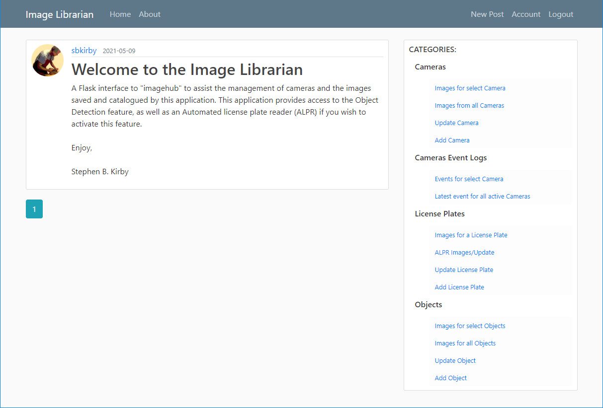

.. contents::

Cameras
=======
Images for select Camera
------------------------
Select the camera you wish to display images.

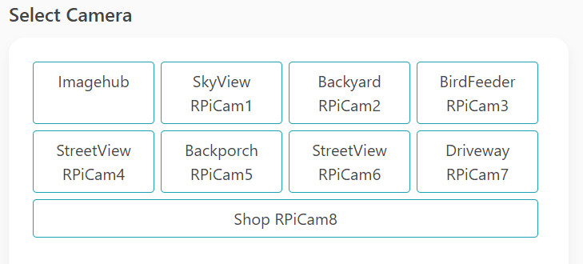

This is an **example** screen of the Cameras for my home installation.  Every installation of **Image Librarian** will contain
the ``Imagehub`` camera (DO NOT DELETE).  This "camera" is the Camera Node that all "system events" are associated with
in the ``imagehub`` application.

A page will appear with all of the images for that camera in descending order.  The number of images currently stored
will appear in parenthesis next to camera name.  Image may be clicked to enlarge, plus once enlarged the images may be
examined in order by pressing the arrow keys on your keyboard or on the screen.

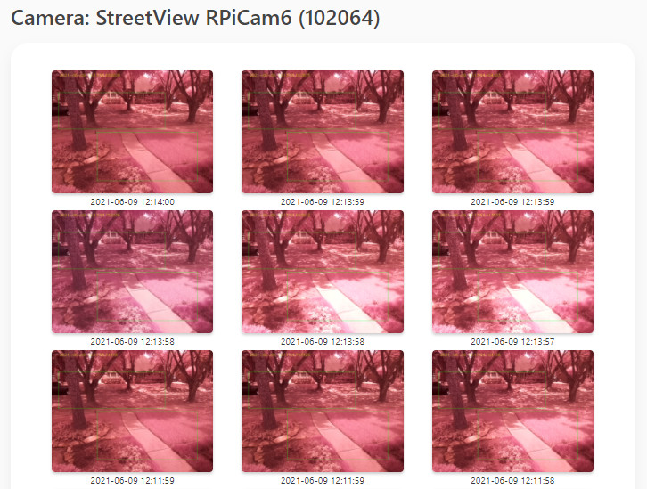

Images from all Cameras
-----------------------
This will display the images from all the cameras in descending order.

.. image:: images/Flask_View.jpg

Update Camera
-------------
Select a camera and update the parameters.  If any field needs updating, click the ``Update`` button and edit the camera
data and ``Submit``.  Camera entries may also be ``Deleted`` if necessary.

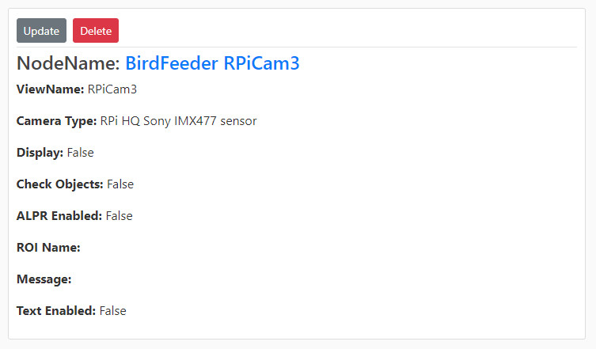

Add Camera
----------
NodeName
^^^^^^^^
The ``NodeName`` is a descriptive name for the camera.  I choose to concatenate the ``node.name`` from the
``imagenode.yaml`` file with the ``cameras.P1.viewname`` (e.g. 'BirdFeeder' and 'RPiCam3').  (REQUIRED)

ViewName
^^^^^^^^
The ``ViewName`` field should match the ``cameras.P1.viewname`` field in the ``imagenode.yaml`` file as seen below (REQUIRED) ::

   # Settings for imagenode.py webcam motion detector testing---
    node:
      name: BirdFeeder #  <-------
      queuemax: 20
      patience: 30
      #heartbeat: 1
      send_type: jpg
      send_threading: True  # sends images in separate thread
      threaded_read: False  # this is the new option; False selects PiCameraUnthreadedStream
      stall_watcher: True  # watches for stalled network or RPi power glitch
      print_settings: True
    hub_address:
      H1: tcp://10.0.0.210:5555
    cameras:
      P1:
        viewname: RPiCam3 #  <-------
        resolution: (800,600)
        exposure_mode: sports
        framerate: 30
        detectors:
          motion:
            ROI: (5,25),(95,85)
            draw_roi: ((255,0,0),1)
            send_frames: detected event # continuous or none or detected event
            send_count: 4 # number of images to send when an event occurs
            delta_threshold: 5 # The minimum intensity difference between the current image and the weighted average of past images
            min_motion_frames: 7 # The minimum number of frames with detected motion to change the state to "moving"
            min_still_frames: 4 # The minimum number of frames with no detected motion to change the state to "still"
            min_area: 2  # minimum area of motion as percent of ROI
            blur_kernel_size: 17  # Guassian Blur kernel size - integer and odd
            send_test_images: False
            print_still_frames: False  # default = True
            draw_time: ((0,255,0),1)
            draw_time_org: (5,5)
            draw_time_fontScale: 0.6

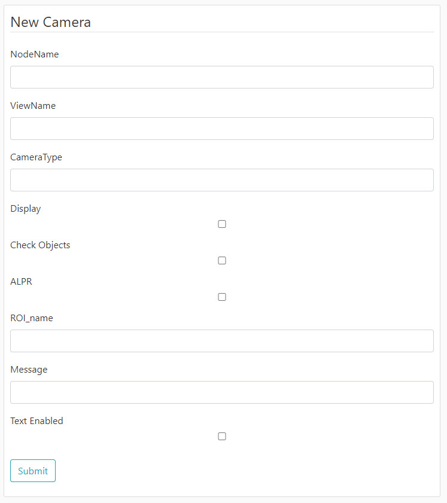

CameraType
^^^^^^^^^^
This is a handy spot to document the type of camera used or information of importance to you. (OPTIONAL)

Display
^^^^^^^
If checked or true, this will allow the camera images to be displayed in the desktop module ``dashboard.py``. (OPTIONAL)

Check Objects
^^^^^^^^^^^^^
If checked or true, this will allow the camera images to be checked for objects by ``MQTT_client.py``. (OPTIONAL)

ALPR
^^^^
If checked or true, this will allow the camera images to be checked by `PLATE RECOGNIZER <https://www.platerecognizer.com/>`_.
You MUST setup an account with PLATE RECOGNIZER, and receive an ``API Token`` to activate and use their services. (OPTIONAL)

ROI_name
^^^^^^^^
This is name(s) found in ``cameras.P1.detectors.motion.roi_name`` field of the ``imagenode.yaml`` file located in the
RPi camera as seen below::

  # Settings for imagenode.py webcam motion detector testing
    ---
    node:
      name: StreetView
      queuemax: 50
      patience: 15
      heartbeat: 1
      send_type: jpg
      #send_threading: True  # sends images in separate thread
      #stall_watcher: True  # watches for stalled network or RPi power glitch
      print_settings: True
    hub_address:
      H1: tcp://10.0.0.100:5555
    cameras:
      P1:
        viewname: RPiCam6
        resolution: (800,600)
        exposure_mode: auto
        framerate: 30
        detectors:
          - motion:
             ROI: (4,18),(70,48)
             roi_name: Street  # <-----------------
             log_roi_name: False
             draw_roi: ((0,255,0),1)
             send_frames: detected event # continuous, none or detected event
             send_count: 7 # number of images to send when an event occurs
             delta_threshold: 7 # The minimum intensity difference between the current image and the weighted average of past images
             min_motion_frames: 5 # The minimum number of frames with detected motion to change the state to "moving"
             min_still_frames: 5 # The minimum number of frames with no detected motion to change the state to "still"
             min_area: 3  # minimum area of motion as percent of ROI
             blur_kernel_size: 21  # Guassian Blur kernel size - integer and odd
             send_test_images: False
             print_still_frames: False  # default = True
             draw_time: ((0,200,0),1)
             draw_time_org: (5,5)
             draw_time_fontScale: 0.5
          - motion:
             ROI: (28,50),(90,90)
             roi_name: FrontDoor  # <-----------------
             log_roi_name: True
             draw_roi: ((0,255,0),1)
             send_frames: detected event # continuous, none or detected event
             send_count: 7 # number of images to send when an event occurs
             delta_threshold: 7 # The minimum intensity difference between the current image and the weighted average of past$
             min_motion_frames: 5 # The minimum number of frames with detected motion to change the state to "moving"
             min_still_frames: 5 # The minimum number of frames with no detected motion to change the state to "still"
             min_area: 3  # minimum area of motion as percent of ROI
             blur_kernel_size: 21  # Guassian Blur kernel size - integer and odd
             send_test_images: False
             print_still_frames: False  # default = True

This is the name of the Region of Interest (ROI) to watch by the **Image Librarian**.  For example, the ``imagenode.yaml``
file above defines an ROI to watch for people approching the ``FrontDoor``.  Unfortunately, at this time only ONE ROI
can be defined per camera.

Message
^^^^^^^
This is the ``Message`` used to send or notify you of a specific event.

Text Enabled
^^^^^^^^^^^^
If enabled, Text messages composed of the "Obect" + "Message" will be sent to the specified email address in ``email Google Voice``
node of the ``Image Librarian Flow`` of Node-Red.

Camera Event Logs
=================
Events for select Camera
------------------------
This option provides a look at the latest events for selected camera.

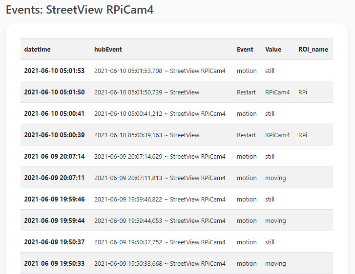

Latest event for all active Cameras
-----------------------------------
This option will display the last event to occur for each camera.  This is handy for monitoring the last activity for all
cameras at one time.

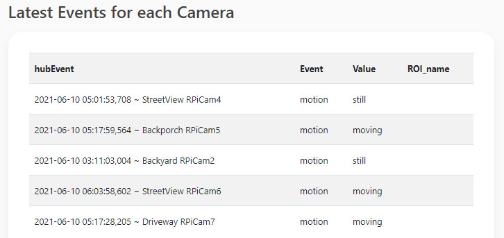

License Plates
==============
Images for a License Plate
--------------------------
Select a License Plate of interest to see all the stored images for that plate.

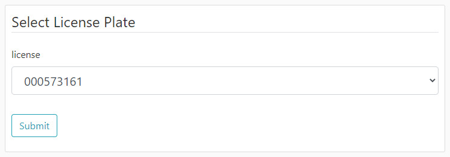

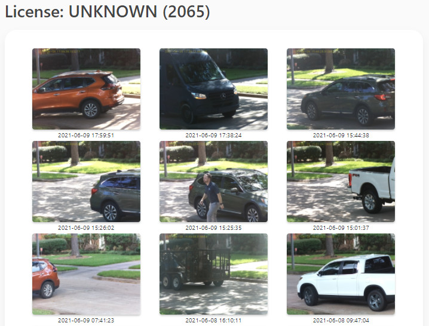

ALPR Images/Update
------------------
Display all ALPR recorded events plus it provides a means of editing the ALPR event by clicking on the link below
each image.

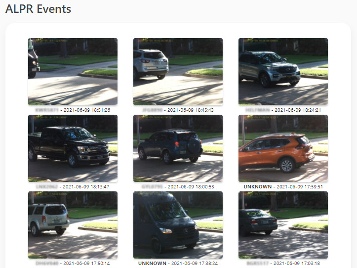

Update License Plate
--------------------
This option provides a means of ``Updating`` and ``Deleting`` a License Plate in the database.  Great caution should
be taken in deleting entries in this Table since other Tables point to these entries.

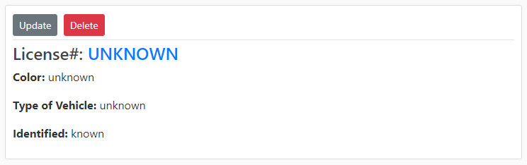
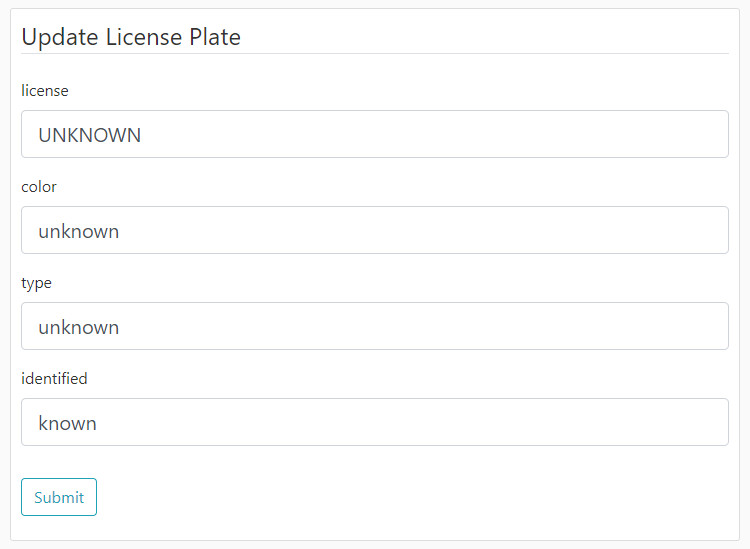

Add License Plate
-----------------
Add a License Plate.

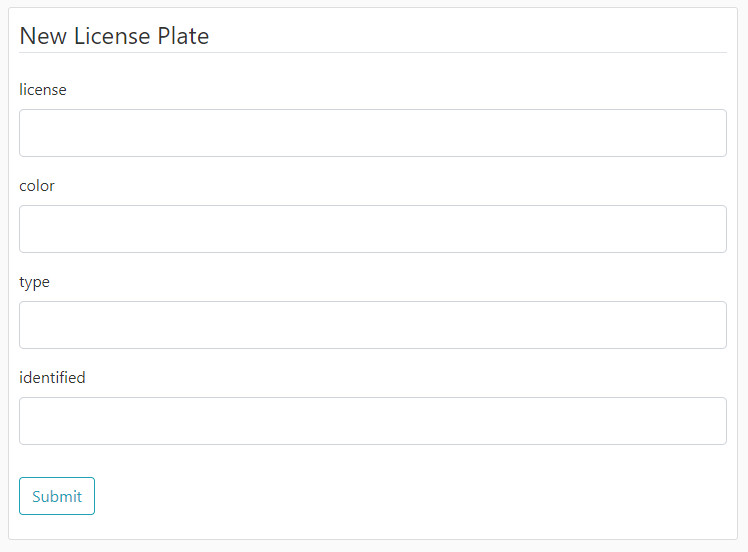

license
^^^^^^^
Enter the License Plate Number in Uppercase.

color
^^^^^
Enter the color of the vehicle.

type
^^^^
Enter the type of vehicle (e.g. car, suv, sedan, pickup truck, big truck, etc.).

identified
^^^^^^^^^^
Enter any identifying information in this field.

Objects
=======
Images for select Objects
-------------------------
Select an Object to view all images for this object.

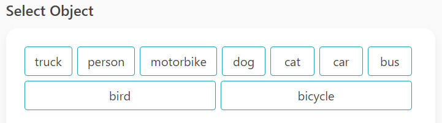
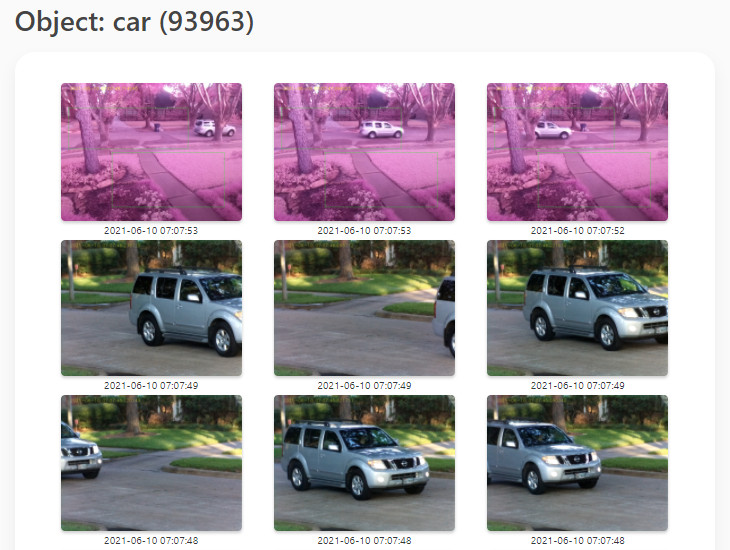

Images for all Objects
----------------------
View images and update Object data for images.  Click the object link below the image to update object data.

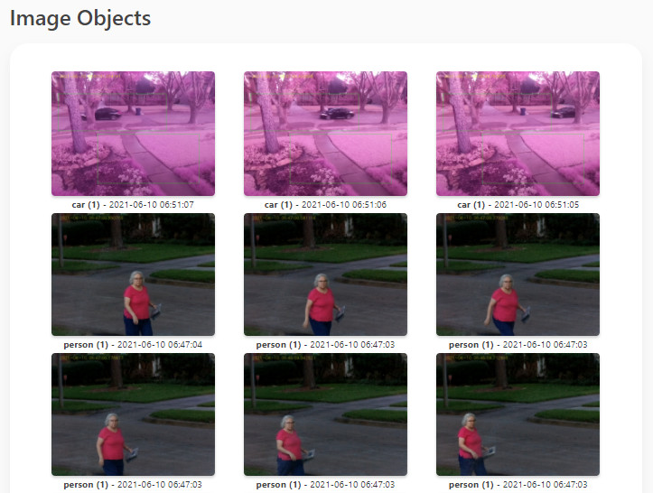

Update Object
-------------
Depricated.

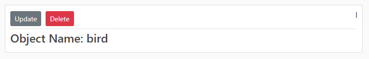
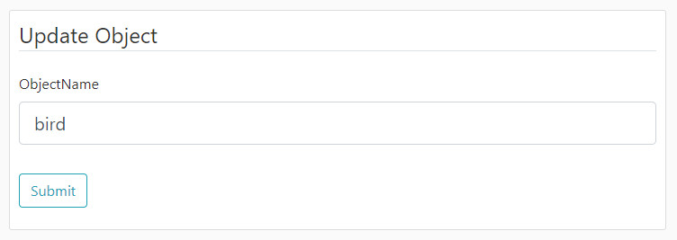

Add Object
----------
Depricated.  The Objects detected by this application are defined in the ``~/IOTstack/tools/coco.names`` file.  Many of
these are household items, and are unlikely to be detected in outdoor cameras.

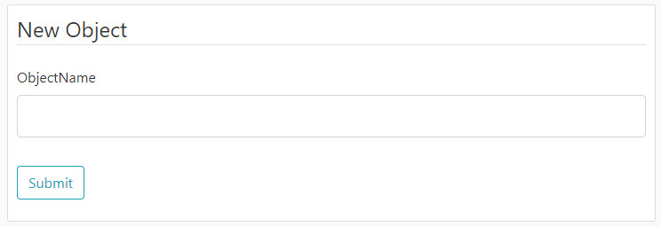
