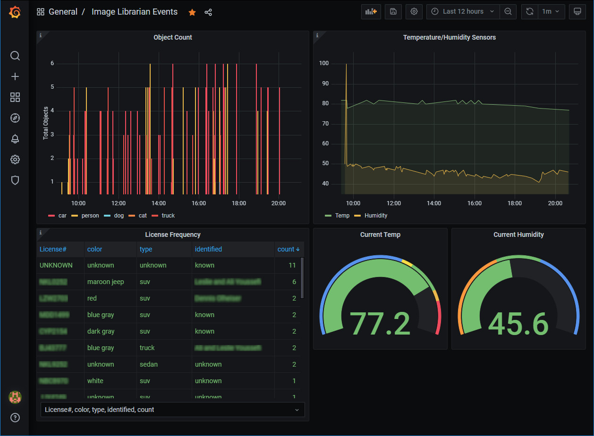
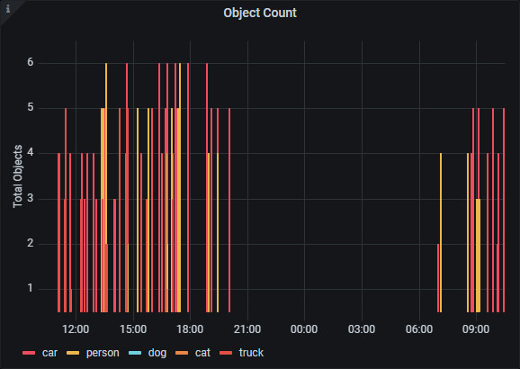
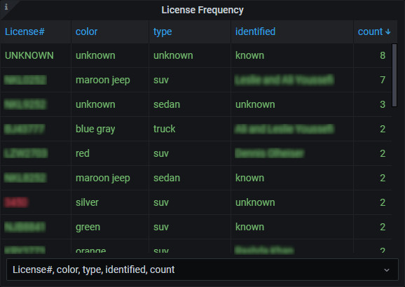
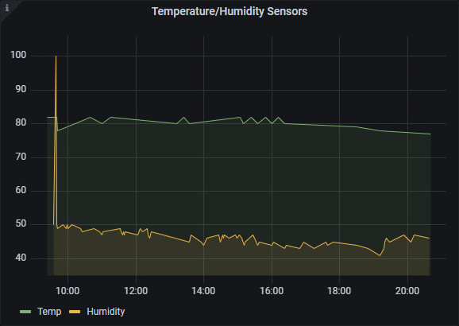
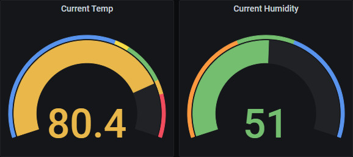
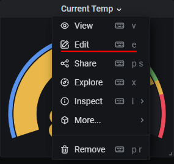

===========================
Grafana Setup and Operation
===========================

.. contents::

Grafana is an analytics and interactive visualization web application. It can provide charts, graphs, and alerts
for the **Image Librarian** data source.

Installation
============
Login
-----
Log into Grafana `http://localhost:3000 <http://localhost:3000>`_ ::

    username: admin
    password: admin
    change password if you wish or Skip

Data Source
-----------
First, configure the database used by Grafana by going to menu ``Configuration -> Data Source``::

    Data Service MySQL
    name: MySQL
    Host: mariadb
    Database: imagehub
    User: mariadbuser	Password: IOtSt4ckmariaDbPw
    save & test

.. image:: images/grafana_database_config.jpg

Import JSON Configuration
-------------------------
Next, install a JSON configuration file, ``Image_Librarian_Events_grafana.json`` located in the ``~/IOTstack/misc`` folder, with charts and tables for the *imagehub* database.
Go to menu ``Dashboards -> Manage``::

    Import -> Image_Librarian_Events_grafana.json
    Name: ALPR Events
    Folder: General
    MySQL: MySQL

.. image:: images/grafana_import_dashboard.jpg

Object Count Graph
==================
A graphical view of all ``Objects`` detected by all cameras.

Each of the legends requires a SQL query for each ``Object`` defined in the ``objects`` TABLE of the database.  Each of
the queries have a unique object to graph.  For example::

  SELECT
     object_id,
     UNIX_TIMESTAMP(datetime) AS "time",
     count(object_id) AS "count"
  FROM image_objects
  WHERE
     $__timeFilter(datetime) and object_id = 'car'
  GROUP BY datetime
  ORDER BY datetime

There are five queries for each ``Object`` (e.g. 'car', 'person', 'dog', 'cat', 'truck').

License Frequency Table
=======================
This table displays all ALPR Events recorded by **Image Librarian**. If the ALPR portion of **Image Librarian**
isn't activated nothing will appear.

This table will display the frequency each ``License Plate`` has been detected over the selected time period.
The following SQL query is displayed::

   SELECT
     license_plates.license as "License#",
     license_plates.color,
     license_plates.type,
     license_plates.identified,
     count(alpr_events.license_id) as "count"
   FROM alpr_events
   INNER JOIN license_plates ON alpr_events.license_id = license_plates.ID
   WHERE $__timeFilter(alpr_events.datetime)
   GROUP BY alpr_events.license_id
   ORDER BY count desc

Temperature/Humidity Sensors Chart
==================================
A chart of the Temperatures and Humidities recorded for each Sensor. The chart is currently setup to display all temperatures and
humidities recorded, and will require customization if more than one Temp/Humidity sensor is used.

The following SQL query will need to be modified for the ``Temp`` and ``Humidity`` for each sensor::

   SELECT
     CAST(Value as DECIMAL) AS "RPiCam9 Temp",
     UNIX_TIMESTAMP(datetime) AS "time"
   FROM events
   WHERE
     $__timeFilter(datetime) and Event = 'Temp' and camera_id = 11
   GROUP BY datetime
   ORDER BY datetime

The ``CAST(Value as DECIMAL) AS "RPiCam9 Temp"`` and ``and camera_id = 11`` additions above will customize
each line on the chart.  Find the ``camera_id`` for your camera in ``camera_nodes`` TABLE.

Current Temp and Current Humidity
=================================
A convenient display of the latest Temperature and Humidity from a select Sensor.

The SQL query will require modification as seen below::

   SELECT
     Value AS "Value"
   FROM events
   WHERE
     $__timeFilter(datetime) AND
     Event = "Temp" AND camera_id = 11
   ORDER BY datetime DESC LIMIT 1

The ``AND camera_id = 11`` is the modification for my installation.  Find the ``camera_id`` for your
camera in ``camera_nodes`` TABLE.

Edit SQL
========
Click the popdown menu next to the Chart/Table and select ``Edit`` to access the SQL queries.

Additional information about working with MySQL and Grafana can be found at `MySQL | Grafana Labs <https://grafana.com/docs/grafana/latest/datasources/mysql/>`_.
