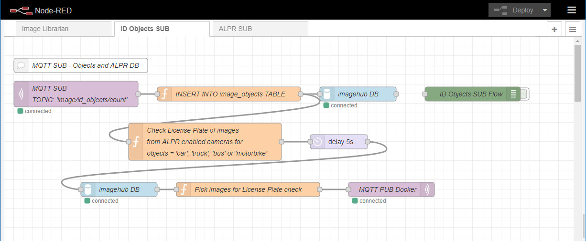
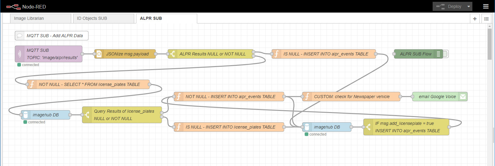

==================================
Node-Red Settings and How it Works
==================================

.. contents::

Image Librarian Flow
====================

tail imagehub.log
-----------------
**Node-Red** is the primary background application monitoring the operation of **imagehub** events and the storage
of images.  The ``tail imagehub.log`` node monitors the log file for events (e.g. 'motion', 'still', 'temperature',
'humidity', etc.).

Example of JSON data from the ``tail imagehub.log`` node::

   {
   "topic":"/data/imagehub_data/logs/imagehub.log",
   "payload":"2021-06-07 08:41:01,130 ~ Backporch RPiCam5|motion|still|BackDoor",
   "_msgid":"7cc4638b.decf1c"
   }

tail payload parser
-------------------
All the events are parsed by the ``tail payload parser`` and stored in the ``events`` table of the ``imagehub`` database.
Example of the output of this node::

  {
  "topic":"INSERT INTO events VALUES (:datetime, :hubEvent, :camera_id, :Event, :Value, :ROI_name)",
  "payload":{
      "datetime":"2021-06-07 08:45:03",
      "hubEvent":"2021-06-07 08:45:03,087 ~ StreetView RPiCam6",
      "camera_id":1,
      "Event":"motion",
      "Value":"moving",
      "ROI_name":"FrontDoor",
      "Viewname":"RPiCam6"
      },
  "_msgid":"a0812019.83aa"
  }

CUSTOM: Check ROI's for Objects
-------------------------------
If for example, an event occurs in a specified *Region of Interest* (ROI) a customized event can be triggered to notify you
of this event via email and/or text message.  The ``CUSTOM: Check ROI's for Objects`` node screens events for cameras
with the ``ROI_name`` field defined in the ``camera_nodes`` table.  The ``roi_name`` must be defined and ``log_roi_name: True``
in the ``imagenode.yaml`` file.  The ``Message`` field of the ``camera_nodes`` table is used to specify the message sent
via email or text.  This **Node-Red** configuration is setup to notify audibly a *object* + *Message* (e.g. 'A person is
at the Front Door').

The ``7 seconds`` delay is there to provide enough time for the image data to be examined for objects and the results
stored in the database. Example of the ``CUSTOM: Check ROI's for Objects`` and results from ``imagehub DB`` query::

   {
   "topic":
      "SELECT COUNT(object_id), object_id
      FROM image_objects
      WHERE image_id LIKE \"%RPiCam5%\"
      AND (datetime >= \"2021-06-07 09:24:40\" AND datetime < \"2021-06-07 09:25:00\")
      AND object_id IN (\"person\",\"dog\",\"cat\")
      GROUP BY object_id",
   "payload":[{"COUNT(object_id)":1,"object_id":"person"}],
   "_msgid":"24f44d11.9af8b2",
   "trigger_audio":true,
   "trigger_text":false,
   "ROI_Message":"is at the backdoor"
   }

CUSTOM: Check for Text trigger and/or CUSTOM: Check for audio trigger
-----------------------------------------------------------------------
Depending on which flags are set ``trigger_audio`` and/or ``trigger_text`` as to which node(s) are triggered, either
``CUSTOM: Check for Text trigger`` and/or ``CUSTOM: Check for audio trigger``.

Adding images to the ``imagehub`` database and checking for objects.

.. image:: images/nodered_watch_images.jpg

watch /data/imagehub_data/images
--------------------------------
Any changes to the ``images`` folder will trigger a *watch* event similar to the following::

   {
   "payload":"/data/imagehub_data/images/2021-06-07/Backporch-RPiCam5-2021-06-07T10.07.07.063070.jpg",
   "topic":"/data/imagehub_data/images",
   "file":"Backporch-RPiCam5-2021-06-07T10.07.07.063070.jpg",
   "filename":"/data/imagehub_data/images/2021-06-07/Backporch-RPiCam5-2021-06-07T10.07.07.063070.jpg",
   "size":24576,
   "type":"file",
   "_msgid":"efc2c3a1.bd67"
   }

add image name to DB
--------------------
This node monitors the *watch* node, and if certain parameters pass the test a SQL call is configured to insert the
image data into the ``images`` TABLE::

   {
   "payload":
      {
      "datetime":"2021-06-07 10:17:49.558968",
      "image":"Driveway-RPiCam7-2021-06-07T10.17.49.558968.jpg",
      "camera_id":8,
      "ViewName":"RPiCam7",
      "size":57344
      },
   "topic":"INSERT IGNORE INTO images VALUES (:datetime, :image, :camera_id, :ViewName, :size)",
   "file":"Driveway-RPiCam7-2021-06-07T10.17.49.558968.jpg",
   "filename":"/data/imagehub_data/images/2021-06-07/Driveway-RPiCam7-2021-06-07T10.17.49.558968.jpg",
   "size":57344,
   "type":"file",
   "_msgid":"e15ff849.3423c8"
   }

MQTT: Check new image for objects
---------------------------------
A ``delay 2 seconds`` is inserted in the process link to delay the MQTT message to the ``MQTT_client.py`` module in order
to give the database ample time to store the image data in ``imagehub`` database.  The ``MQTT: Check new image for objects``
node monitors the messages from the *watch* node, and if the ``Chk_Objects`` field of the ``camera_nodes`` table are **True**
a MQTT message will be sent to the ``MQTT_client.py`` to check for objects::

   {
   "payload":"/data/volumes/nodered/data/imagehub_data/images/2021-06-07/Driveway-RPiCam7-2021-06-07T10.40.31.345038.jpg",
   "topic":"image/id_objects/get_objects",
   "file":"Driveway-RPiCam7-2021-06-07T10.40.31.345038.jpg",
   "filename":"/data/imagehub_data/images/2021-06-07/Driveway-RPiCam7-2021-06-07T10.40.31.345038.jpg",
   "size":20480,
   "type":"file",
   "_msgid":"9dc555e0.07a018",
   "image":"Driveway-RPiCam7-2021-06-07T10.40.31.345038.jpg"
   }

Find last image for each camera to display
------------------------------------------
The python module ``dashboard.py`` uses the ``latest_images.json`` file as its data source to display the "Latest" images
from each camera with the ``Display`` field of the ``camera_nodes`` TABLE set to **True**::

   {
   "payload":{"cameras_id":[1,2,3,4,8]},
   "topic":
      "SELECT images.*
      FROM
         (SELECT camera_id, MAX(image) AS image
         FROM images
         WHERE camera_id IN (:cameras_id)
         GROUP BY camera_id) AS latest_images
      INNER JOIN images ON images.camera_id = latest_images.camera_id AND images.image = latest_images.image;",
   "file":"StreetView-RPiCam6-2021-06-07T10.52.15.312544.jpg",
   "filename":"/data/imagehub_data/images/2021-06-07/StreetView-RPiCam6-2021-06-07T10.52.15.312544.jpg",
   "size":40960,
   "type":"file",
   "_msgid":"1d8757b9.df0ce8"
   }

The output of this query is formated by the ``JSON format latest images payload`` node, and passed on to the ``create data file``
node.  If need be, the ``latest_images.json`` file may be created manually with the ``manually create latest_images.json file``
node.

Configure/Edit the Directories
------------------------------
.. image:: images/nodered_configuration_directories.jpg

The ``Configuration Directories`` node contains the list of directories used by all the flows.  The folders containing
``YOUR_HOME_DIRECTORY`` require editing to match your installation.  These entries are used to create the **global**
variables available to all the flows as seen below:

.. image:: images/nodered_global_variables.jpg

Build flow variables from imagehub.camera_nodes Table
-----------------------------------------------------
This section generates the **global** variables from the entries in the ``camera_nodes`` table.  It creates a list of
the cameras for 'Display', 'Chk_Objects', 'ALPR' and 'Twilio_Enabled', as well the cataloging the 'ROI_name' and the
'Message' for each entry.  Examples of these variables can be seen in the image above.

Purge Db and Delete Folders
---------------------------
The ``Routine Purge of Images and Db Entries`` node contains the ``msg.daystokeep`` value used to determine the number
of days to keep images.  This runs each evening after midnight, and builds a ``purge_folders.json`` file used by
``purge_folders.py``.  In addition to purging images from the server, this will purge entries older than ``msg.daystokeep``
in three tables of the ``imagehub`` database.

ID Objects SUB Flow
===================
This is a **MQTT SUBSCRIPTION** for **TOPIC** ``image/id_objects/count``.  This receives MQTT messages from ``MQTT_client.py``
with the object detection results for each analyzed image.

INSERT INTO image_objects TABLE
-------------------------------
This node processes the MQTT messages and inserts the object data into the ``image_objects`` table::

  {
  "topic":
     "INSERT IGNORE INTO image_objects (datetime, image_id, object_id, count)
     VALUES (:datetime, :image_id, :object_id, :count);",
  "payload":{
     "datetime":"2021-06-07T14:53:24.692104",
     "image_id":"Backporch-RPiCam5-2021-06-07T14.53.24.692104.jpg",
     "object_id":"person",
     "count":1
     },
  "qos":1,
  "retain":false,
  "_msgid":"150261bf.2c586e",
  "results":{"person":1}
  }

Check License Plate of images from ALPR enabled cameras
-------------------------------------------------------
If the ``ALPR`` field of the ``camera_nodes`` TABLE is **True**, and a 'car', 'truck' or 'motorbike' appear in the image
this function node will build a query to select the images for ``ALPR SUB Flow`` processing.  The query is ``delayed 5 seconds``
to allow for the object data to be stored in the ``image_objects`` TABLE.  The results of the ``imagehub DB`` are as follows::

   {
   "topic":
      "SELECT image_id
      FROM image_objects
      WHERE image_id LIKE \"%RPiCam4%\" AND (datetime >= \"2021-06-07 19:46:36\" AND datetime < \"2021-06-07 19:46:46\")
      AND object_id IN (\"car\",\"truck\",\"motorbike\")",
   "payload":[
      {"image_id":"StreetView-RPiCam4-2021-06-07T19.46.40.746435.jpg"},
      {"image_id":"StreetView-RPiCam4-2021-06-07T19.46.40.981745.jpg"},
      {"image_id":"StreetView-RPiCam4-2021-06-07T19.46.41.223360.jpg"},
      {"image_id":"StreetView-RPiCam4-2021-06-07T19.46.41.467526.jpg"},
      {"image_id":"StreetView-RPiCam4-2021-06-07T19.46.41.735559.jpg"},
      {"image_id":"StreetView-RPiCam4-2021-06-07T19.46.41.975115.jpg"},
      {"image_id":"StreetView-RPiCam4-2021-06-07T19.46.42.234091.jpg"},
      {"image_id":"StreetView-RPiCam4-2021-06-07T19.46.42.477552.jpg"}
      ],
   "qos":1,
   "retain":false,
   "_msgid":"b7bb6bdd.3fd2e8",
   "results":{"car":1},
   "datetime":"2021-06-08T00:46:41.467Z"
   }

Pick images for License Plate check
-----------------------------------
This function node selects two images from a list, and constructs a MQTT message to send to the ``ALPR SUB Flow``::

   {
   "topic":"image/alpr/get_license",
   "payload":{
      "filename":[
         "/home/stephen/IOTstack/volumes/nodered/data/imagehub_data/images/2021-06-07/StreetView-RPiCam4-2021-06-07T19.46.40.981745.jpg",
         "/home/stephen/IOTstack/volumes/nodered/data/imagehub_data/images/2021-06-07/StreetView-RPiCam4-2021-06-07T19.46.42.234091.jpg"
         ]},
   "qos":1,
   "retain":false,
   "_msgid":"ff989c35.f9e6",
   "results":{"car":1},
   "datetime":"2021-06-08T00:46:41.467Z"
   }

ALPR SUB Flow
=============

The **ALPR SUBSCRIPTION Flow** receives the MQTT message results from ``MQTT_client.py``::

   {
   "topic":"image/alpr/results",
   "payload":{
      "processing_time":109.041,
      "results":[
         {
            "box":{"xmin":418,"ymin":400,"xmax":508,"ymax":450},
            "plate":"nkl0252",
            "region":{"code":"us-tx","score":0.866},
            "score":0.899,
            "candidates":[{"score":0.899,"plate":"nkl0252"}],
            "dscore":0.782,
            "vehicle":{"score":0.784,"type":"SUV","box":{"xmin":0,"ymin":172,"xmax":686,"ymax":724}}}],
            "filename":"1405_eBtcL_StreetView-RPiCam4-2021-06-08T09.04.50.986564.jpg",
            "version":1,
            "camera_id":null,
            "timestamp":"2021-06-08T14:05:00.134251Z"
         },
   "qos":1,
   "retain":false,
   "_msgid":"7e6fe204.7c7cdc"
   }

JSONize msg.payload and ALPR Results NULL or NOT NULL
-----------------------------------------------------
The messages are JSON'ized via the ``JSONize msg.payload`` node and the ``msg.results`` is checked IF *NULL* or
*NOT NULL* in the ``ALPR Results NULL or NOT NULL`` node.

NOT NULL - SELECT * FROM license_plates TABLE
---------------------------------------------
If the ``msg.results`` are *NOT NULL* from the ``ALPR Results NULL or NOT NULL`` node, a query is performed on the
``msg.payload.results[0].plate.toUpperCase()`` to find the closest match via the ``NOT NULL - SELECT * FROM license_plates TABLE`` node::

  {
  "topic":
     "SELECT * FROM license_plates
     WHERE (`license` = :plate OR `license` LIKE :plate1 OR `license` LIKE :plate2)",
  "payload":[{"ID":11,"license":"LNX2062","color":"dark blue","type":"truck","identified":"known"}],
  "qos":1,
  "retain":false,
  "_msgid":"27f384ff.05ca2c",
  "plate":"LNX2062",
  "image":"StreetView-RPiCam4-2021-06-08T09.23.34.783643.jpg",
  "score":0.88,
  "processing_time":211.701,
  "vehicle_type":"suv",
  "datetime":"2021-06-08T09:23:34.783643"
  }

IS NULL - INSERT INTO alpr_events TABLE
---------------------------------------
If the ``msg.results`` are *NULL* from the ``ALPR Results NULL or NOT NULL`` node, a query is performed on the
``msg.payload.results[0].plate.toUpperCase()`` to find the closest match via the ``IS NULL - INSERT INTO alpr_events TABLE`` node::

  {
  "topic":
     "INSERT INTO alpr_events (license_id, datetime, image_id, processing_time)
     VALUES (:license_id, :datetime, :image_id, :processing_time)",
  "payload":{"license_id":1,"datetime":"2021-06-09T17:59:51","image_id":"StreetView-RPiCam4-2021-06-09T17.59.42.223840.jpg","processing_time":110.603},
  "qos":1,
  "retain":false,
  "_msgid":"2eb2307a.5551d",
  "add_licenseplate":false,
  "image":"StreetView-RPiCam4-2021-06-09T17.59.42.223840.jpg",
  "processing_time":110.603,
  "datetime":"2021-06-09T17:59:51"
  }

Query Results of license_plates NULL or NOT NULL
------------------------------------------------
This node checks the ``msg.payload[0]`` to see if it is *NULL* OR *NOT NULL*.

NOT NULL - INSERT INTO alpr_events TABLE
----------------------------------------
If the ``Query Results of license_plates NULL or NOT NULL`` is *NOT NULL*, the data is INSERT'd into the ``alpr_events`` TABLE
and ``msg.add_licenseplate`` is set to *false*::

   {
   "topic":
      "INSERT INTO alpr_events (license_id, datetime, image_id, processing_time)
      VALUES (:license_id, :datetime, :image_id, :processing_time)",
   "payload":{"fieldCount":0,"affectedRows":1,"insertId":10841,"info":"","serverStatus":2,"warningStatus":0},
   "qos":1,
   "retain":false,
   "_msgid":"77fef66.5b28b08",
   "plate":"HVK6508",
   "image":"StreetView-RPiCam4-2021-06-08T09.29.51.079569.jpg",
   "score":0.905,
   "processing_time":227.195,
   "vehicle_type":"sedan",
   "datetime":"2021-06-08T09:29:51.079569",
   "add_licenseplate":false
   }

IS NULL - INSERT INTO license_plates TABLE
------------------------------------------
If the ``Query Results of license_plates NULL or NOT NULL`` is *NULL*, the data is INSERT'd into the ``license_plates`` Table
and ``msg.add_licenseplate`` is set to *true*::

  {
  "topic":
     "INSERT INTO license_plates (license, color, type, identified)
     VALUES (:license, :color, :type, :identified)",
  "payload":{"license":"PDH6456","color":"unknown","type":"pickup truck","identified":"unknown"},
  "qos":1,
  "retain":false,
  "_msgid":"5ba0f181.95898",
  "plate":"PDH6456",
  "image":"StreetView-RPiCam4-2021-06-09T11.10.58.338754.jpg",
  "score":0.903,
  "processing_time":99.411,
  "vehicle_type":"pickup truck",
  "datetime":"2021-06-09T11:11:06",
  "add_licenseplate":true
  }

IF msg.add_licenseplate = true INSERT INTO alpr_events TABLE
------------------------------------------------------------
This switch node checks the results of each ``imagehub DB`` node query for ``msg.add_licenseplate`` flag, and IF *True*
routes the message to ``NOT NULL - INSERT INTO alpr_events TABLE`` to create a ``alpr_events`` entry for the
**NEW** License Plate entry.

CUSTOM: check for Newspaper vehicle
-----------------------------------
This is an example of monitoring ALPR Events for a specific License Plate.  When the plate(s) are matched it sends an email
or Text message to the specified address.
