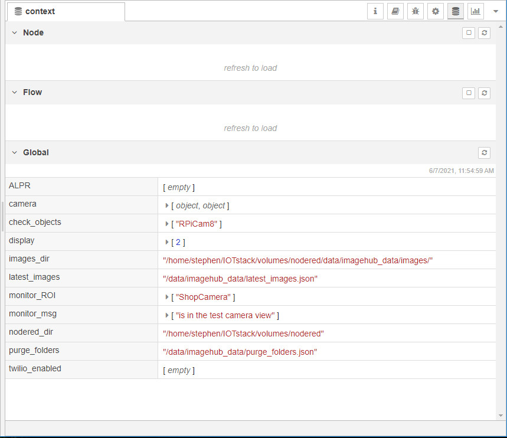

==================================
Node-Red Settings and How it Works
==================================

.. contents::

Image Librarian
===============

tail imagehub.log
-----------------
**Node-Red** is the primary background application monitoring the operation of **imagehub** events and the storage
of images.  The ``tail imagehub.log`` node monitors the log file for events (e.g. 'motion', 'still', 'temperature',
'humidity', etc.).

.. image:: images/nodered_tail_imagehub.log.jpg

Example of JSON data from the ``tail imagehub.log`` node::

   {
   "topic":"/data/imagehub_data/logs/imagehub.log",
   "payload":"2021-06-07 08:41:01,130 ~ Backporch RPiCam5|motion|still|BackDoor",
   "_msgid":"7cc4638b.decf1c"
   }

tail payload parser
-------------------
All the events are parsed by the ``tail payload parser`` and stored in the ``events`` table of the ``imagehub`` database.
Example of the output of this node::

  {
  "topic":"INSERT INTO events VALUES (:datetime, :hubEvent, :camera_id, :Event, :Value, :ROI_name)",
  "payload":{
      "datetime":"2021-06-07 08:45:03",
      "hubEvent":"2021-06-07 08:45:03,087 ~ StreetView RPiCam6",
      "camera_id":1,
      "Event":"motion",
      "Value":"moving",
      "ROI_name":"FrontDoor",
      "Viewname":"RPiCam6"
      },
  "_msgid":"a0812019.83aa"
  }

CUSTOM: Check ROI's for Objects
-------------------------------
If for example, an event occurs in a specified *Region of Interest* (ROI) a customized event can be triggered to notify you
of this event via email and/or text message.  The ``CUSTOM: Check ROI's for Objects`` node screens events for cameras
with the ``ROI_name`` field defined in the ``camera_nodes`` table.  The ``roi_name`` must be defined and ``log_roi_name: True``
in the ``imagenode.yaml`` file.  The ``Message`` field of the ``camera_nodes`` table is used to specify the message sent
via email or text.  This **Node-Red** configuration is setup to notify audibly a *object* + *Message* (e.g. 'A person is
at the Front Door').

The ``7 seconds`` delay is there to provide enough time for the image data to be examined for objects and the results
stored in the database. Example of the ``CUSTOM: Check ROI's for Objects`` and results from ``imagehub DB`` query::

   {
   "topic":
      "SELECT COUNT(object_id), object_id
      FROM image_objects
      WHERE image_id LIKE \"%RPiCam5%\"
      AND (datetime >= \"2021-06-07 09:24:40\" AND datetime < \"2021-06-07 09:25:00\")
      AND object_id IN (\"person\",\"dog\",\"cat\")
      GROUP BY object_id",
   "payload":[{"COUNT(object_id)":1,"object_id":"person"}],
   "_msgid":"24f44d11.9af8b2",
   "trigger_audio":true,
   "trigger_twilio":false,
   "ROI_Message":"is at the backdoor"
   }

CUSTOM: Check for twilio trigger and/or CUSTOM: Check for audio trigger
-----------------------------------------------------------------------
Depending on which flags are set ``trigger_audio`` and/or ``trigger_twilio`` as to which node(s) are triggered, either
``CUSTOM: Check for twilio trigger`` and/or ``CUSTOM: Check for audio trigger``.  Note: This application does not require
Twilio...It was used at one time, and the variables remain to confuse me and you.

Adding images to the ``imagehub`` database and checking for objects.

watch /data/imagehub_data/images
--------------------------------
Any changes to the ``images`` folder will trigger a *watch* event similar to the following::

   {
   "payload":"/data/imagehub_data/images/2021-06-07/Backporch-RPiCam5-2021-06-07T10.07.07.063070.jpg",
   "topic":"/data/imagehub_data/images",
   "file":"Backporch-RPiCam5-2021-06-07T10.07.07.063070.jpg",
   "filename":"/data/imagehub_data/images/2021-06-07/Backporch-RPiCam5-2021-06-07T10.07.07.063070.jpg",
   "size":24576,
   "type":"file",
   "_msgid":"efc2c3a1.bd67"
   }

add image name to DB
--------------------
This node monitors the *watch* node, and if certain parameters pass the test a SQL call is configured to insert the
image data into the ``images`` table::

   {
   "payload":
      {
      "datetime":"2021-06-07 10:17:49.558968",
      "image":"Driveway-RPiCam7-2021-06-07T10.17.49.558968.jpg",
      "camera_id":8,
      "ViewName":"RPiCam7",
      "size":57344
      },
   "topic":"INSERT IGNORE INTO images VALUES (:datetime, :image, :camera_id, :ViewName, :size)",
   "file":"Driveway-RPiCam7-2021-06-07T10.17.49.558968.jpg",
   "filename":"/data/imagehub_data/images/2021-06-07/Driveway-RPiCam7-2021-06-07T10.17.49.558968.jpg",
   "size":57344,
   "type":"file",
   "_msgid":"e15ff849.3423c8"
   }

MQTT: Check new image for objects
---------------------------------
A ``delay 2 seconds`` is inserted in the process link to delay the MQTT message to the ``MQTT_client.py`` module in order
to give the database ample time to store the image data in ``imagehub`` database.  The ``MQTT: Check new image for objects``
node monitors the messages from the *watch* node, and if the ``Chk_Objects`` field of the ``camera_nodes`` table are **True**
a MQTT message will be sent to the ``MQTT_client.py`` to check for objects::

   {
   "payload":"/data/volumes/nodered/data/imagehub_data/images/2021-06-07/Driveway-RPiCam7-2021-06-07T10.40.31.345038.jpg",
   "topic":"image/id_objects/get_objects",
   "file":"Driveway-RPiCam7-2021-06-07T10.40.31.345038.jpg",
   "filename":"/data/imagehub_data/images/2021-06-07/Driveway-RPiCam7-2021-06-07T10.40.31.345038.jpg",
   "size":20480,
   "type":"file",
   "_msgid":"9dc555e0.07a018",
   "image":"Driveway-RPiCam7-2021-06-07T10.40.31.345038.jpg"
   }

Find last image for each camera to display
------------------------------------------
The python module ``dashboard.py`` uses the ``latest_images.json`` file as its data source to display the "Latest" images
from each camera with the ``Display`` field of the ``camera_nodes`` set to **True**::

   {
   "payload":{"cameras_id":[1,2,3,4,8]},
   "topic":
      "SELECT images.*
      FROM
         (SELECT camera_id, MAX(image) AS image
         FROM images
         WHERE camera_id IN (:cameras_id)
         GROUP BY camera_id) AS latest_images
      INNER JOIN images ON images.camera_id = latest_images.camera_id AND images.image = latest_images.image;",
   "file":"StreetView-RPiCam6-2021-06-07T10.52.15.312544.jpg",
   "filename":"/data/imagehub_data/images/2021-06-07/StreetView-RPiCam6-2021-06-07T10.52.15.312544.jpg",
   "size":40960,
   "type":"file",
   "_msgid":"1d8757b9.df0ce8"
   }

The output of this query is formated by the ``JSON format latest images payload`` node, and passed on to the ``create data file``
node.  If need be, the ``latest_images.json`` file may be created manually with the ``manually create\n latest_images.json file``
node.

Configure/Edit the Directories
------------------------------
.. image:: images/nodered_configuration_directories.jpg

The ``Configuration Directories`` node contains the list of directories used with the **Image Librarian** flows.  The folders containing
``YOUR_HOME_DIRECTORY`` require editing to match your installation.  These entries are used to create the **global**
variables available to all the flows as seen below:

Build flow variables from imagehub.camera_nodes Table
-----------------------------------------------------
This section generates the **global** variables from the entries in the ``camera_nodes`` table.  It creates a list of
the cameras for 'Display', 'Chk_Objects', 'ALPR' and 'Twilio_Enabled', as well the cataloging the 'ROI_name' and the
'Message' for each entry.  Examples of these variables can be seen in the image above.

Purge Db and Delete Folders
---------------------------
The ``Routine Purge of Images and Db Entries`` node contains the ``msg.daystokeep`` value used to determine the number
of days of images to keep.  This runs each evening after midnight, and builds a ``purge_folders.json`` file used by
``purge_folders.py``
